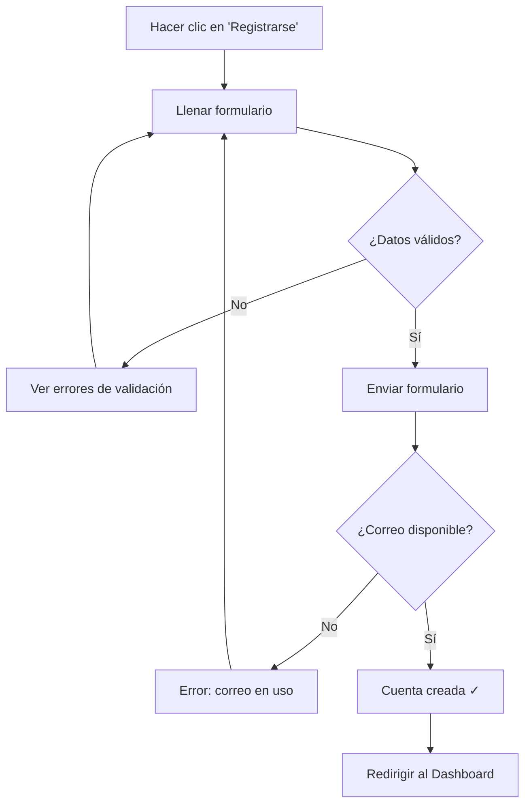
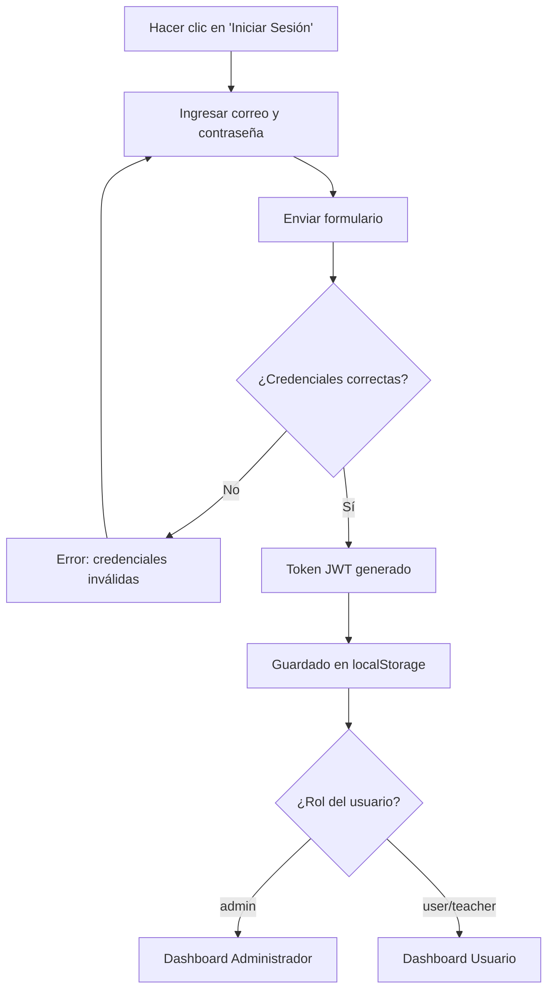
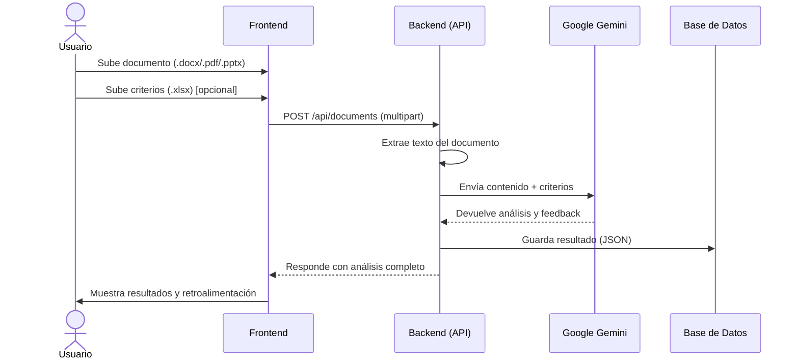
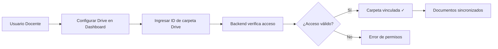
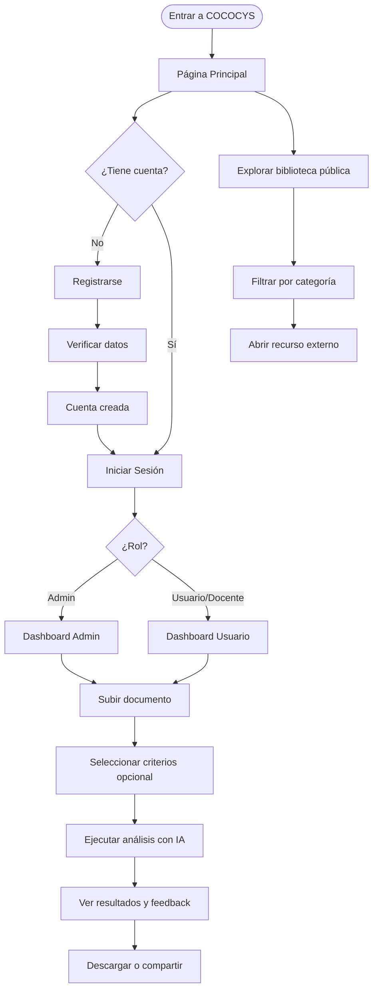

# Manual de Usuario — COCOCYS Web Platform

> **Versión:** 1.0.0 · **Fecha:** Marzo 2026 · **Audiencia:** Usuarios finales (estudiantes, docentes)

---

## Tabla de Contenidos

1. [Introducción](#1-introducción)
2. [Acceso a la Plataforma](#2-acceso-a-la-plataforma)
3. [Página Principal](#3-página-principal)
4. [Registro e Inicio de Sesión](#4-registro-e-inicio-de-sesión)
5. [Dashboard de Usuario](#5-dashboard-de-usuario)
6. [Dashboard Administrativo](#6-dashboard-administrativo)
7. [Análisis de Documentos](#7-análisis-de-documentos)
8. [Integración con Google Drive](#8-integración-con-google-drive)
9. [Flujo Completo de Uso](#9-flujo-completo-de-uso)
10. [Preguntas Frecuentes](#10-preguntas-frecuentes)

---

## 1. Introducción

**COCOCYS** (Consolidación de Conocimiento en Ciencias y Sistemas) es una plataforma web educativa que ofrece:

- **Biblioteca digital** de recursos académicos (código, tutoriales, documentación)
- **Análisis automático de documentos** mediante Inteligencia Artificial (Google Gemini)
- **Evaluación de criterios** para documentos Word, PDF y PowerPoint
- **Integración con Google Drive** para gestión de archivos

### Tipos de usuarios

| Rol | Descripción | Acceso |
|-----|-------------|--------|
| **Visitante** | Sin cuenta. Solo puede ver recursos públicos | Página principal |
| **Usuario** | Cuenta registrada. Puede subir y analizar documentos | Dashboard usuario |
| **Docente** | Cuenta con permisos ampliados. Gestiona carpetas Drive | Dashboard + Drive |
| **Administrador** | Acceso total. Configura el sistema y analiza documentos | Dashboard admin |

---

## 2. Acceso a la Plataforma

La plataforma es accesible desde cualquier navegador moderno:

| Entorno | URL |
|---------|-----|
| Local (desarrollo) | `http://localhost` |
| Local (API docs) | `http://localhost:8000/docs` |

### Navegadores compatibles

- Google Chrome 90+
- Mozilla Firefox 88+
- Microsoft Edge 90+
- Safari 14+

---

## 3. Página Principal

Al ingresar a la plataforma, el usuario ve la **Biblioteca Digital COCOCYS**.

### Diagrama de la página principal

```
┌─────────────────────────────────────────────────────┐
│  NAVBAR: [Logo COCOCYS]  [Iniciar Sesión] [Registro] │
├─────────────────────────────────────────────────────┤
│                   HERO SECTION                       │
│           Logo Principal + Logo Secundario           │
│              🔵 Biblioteca Digital                   │
│                                                      │
│         COCOCYS Centro de Recursos                   │
│   Accede a documentación, código, tutoriales...     │
│                                                      │
│   [ 12 Recursos ] [ 4 Categorías ] [ Semanales ]    │
├─────────────────────────────────────────────────────┤
│  BÚSQUEDA: [ 🔍 Buscar por título, descripción... ] │
│  FILTROS:  [Todos] [Documentación] [Código] [Tuts]  │
├─────────────────────────────────────────────────────┤
│  GRID DE RECURSOS (cards animadas)                   │
│  ┌──────────┐ ┌──────────┐ ┌──────────┐            │
│  │ YouTube  │ │  GitHub  │ │  Drive   │            │
│  │ [título] │ │ [título] │ │ [título] │            │
│  │ [desc]   │ │ [desc]   │ │ [desc]   │            │
│  │ #tags    │ │ #tags    │ │ #tags    │            │
│  │Ver →     │ │Ver →     │ │Ver →     │            │
│  └──────────┘ └──────────┘ └──────────┘            │
├─────────────────────────────────────────────────────┤
│  FOOTER: COCOCYS | GitHub | Inicio | Contacto       │
└─────────────────────────────────────────────────────┘
```

### Recursos disponibles

| # | Recurso | Tipo | Categoría |
|---|---------|------|-----------|
| 1 | Metodología COCOCYS - Segundo Ciclo | YouTube | Tutoriales |
| 2 | Cómo redactar una competencia | YouTube | Tutoriales |
| 3 | Calificación de Proyectos COCOCYS | YouTube | Tutoriales |
| 4 | Estructura de Datos | GitHub | Código |
| 5 | Algoritmos | GitHub | Código |
| 6 | Programación de Computadoras I | GitHub | Código |
| 7 | Programación de Computadoras II | GitHub | Código |
| 8 | Análisis y Diseño de Sistemas I | GitHub | Documentación |
| 9 | Software Avanzado | GitHub | Código |
| 10 | Manejo e Implementación de Archivos | GitHub | Código |
| 11 | Repositorio Web COCOCYS | GitHub | Código |
| 12 | Canal de YouTube COCOCYS | YouTube | Tutoriales |

### Cómo buscar recursos

1. Escribe en la barra de búsqueda (filtra por título, descripción o etiquetas)
2. Usa los botones de categoría para filtrar: **Todos / Documentación / Código / Tutoriales**
3. Haz clic en **"Ver recurso"** para abrir el enlace en una pestaña nueva

---

## 4. Registro e Inicio de Sesión

### 4.1 Registrarse



**Campos requeridos:**
- Nombre
- Apellidos
- Correo electrónico (único)
- Contraseña (mínimo seguro)

### 4.2 Iniciar Sesión



### 4.3 Cerrar Sesión

- En el Dashboard, busca el botón **"Cerrar sesión"** o **"Logout"**
- El token se elimina del navegador automáticamente
- Serás redirigido a la página principal

---

## 5. Dashboard de Usuario

El dashboard de usuario permite gestionar documentos personales.

### Vista general

```
┌─────────────────────────────────────────────────────┐
│  DASHBOARD                          [Hola, Nombre!] │
│  ─────────────────────────────────────────────────  │
│                                                      │
│  📂 Mis Documentos                                  │
│  ┌─────────────────────────────────────────────┐   │
│  │  [Subir Documento]                          │   │
│  │                                             │   │
│  │  Lista de documentos subidos:               │   │
│  │  • documento1.pdf    ✓ Completado           │   │
│  │  • informe.docx      ⏳ Procesando          │   │
│  │  • presentacion.pptx ✓ Completado           │   │
│  └─────────────────────────────────────────────┘   │
│                                                      │
│  📊 Resultados de Análisis                          │
│  [Ver detalles del último análisis]                 │
└─────────────────────────────────────────────────────┘
```

### Formatos de documentos aceptados

| Extensión | Tipo | Tamaño máximo |
|-----------|------|---------------|
| `.pdf` | PDF | 10 MB |
| `.docx` | Word | 10 MB |
| `.pptx` | PowerPoint | 10 MB |
| `.xlsx` | Excel (criterios) | 10 MB |

---

## 6. Dashboard Administrativo

Los usuarios con rol **administrador** tienen acceso a herramientas avanzadas.

### Funcionalidades exclusivas

```
┌─────────────────────────────────────────────────────┐
│  ADMIN DASHBOARD                                     │
│  ─────────────────────────────────────────────────  │
│                                                      │
│  🔬 Analizador de Documentos                        │
│  ┌─────────────────────────────────────────────┐   │
│  │  Documento a analizar:  [Seleccionar .docx] │   │
│  │  Criterios de eval.:    [Seleccionar .xlsx] │   │
│  │                         [Analizar ▶]        │   │
│  └─────────────────────────────────────────────┘   │
│                                                      │
│  ⚙️ Configuración del Sistema                       │
│  • Gestionar validaciones                           │
│  • Ver métricas y logs                              │
│  • Administrar usuarios                             │
└─────────────────────────────────────────────────────┘
```

---

## 7. Análisis de Documentos

El análisis usa **Google Gemini** (IA generativa) para evaluar documentos.

### Flujo de análisis



### Estados de un documento

| Estado | Descripción |
|--------|-------------|
| `uploaded` | Documento recibido, pendiente de procesar |
| `processing` | Análisis en curso con IA |
| `completed` | Análisis finalizado con éxito |
| `failed` | Error durante el procesamiento |

---

## 8. Integración con Google Drive

Los usuarios con rol **docente o admin** pueden conectar su cuenta de Google Drive.

### Flujo de conexión



---

## 9. Flujo Completo de Uso



---

## 10. Preguntas Frecuentes

**¿Qué formatos de documento acepta la plataforma?**
> PDF, Word (.docx), PowerPoint (.pptx) y Excel (.xlsx) para criterios. Tamaño máximo: 10 MB por archivo.

**¿Los recursos de la biblioteca son gratuitos?**
> Sí. Todos los recursos son de acceso libre. Están alojados en GitHub y YouTube.

**¿Mi sesión tiene una duración límite?**
> Sí. El token de sesión expira en 30 minutos de inactividad. Al expirar, serás redirigido al login.

**¿El análisis con IA es inmediato?**
> El tiempo de análisis depende del tamaño del documento y la carga del servidor. Documentos cortos se analizan en segundos; documentos extensos pueden tardar hasta un minuto.

**¿Puedo ver el resultado de análisis anteriores?**
> Sí. Desde el Dashboard puedes acceder al historial de documentos analizados y sus resultados.

**¿Qué hago si un documento falla en el análisis?**
> Verifica que el archivo no esté corrupto y que sea uno de los formatos aceptados. Si el problema persiste, contacta al administrador.

---

*Manual generado automáticamente en base al código fuente del proyecto COCOCYS v1.0.0*
*Desarrollado por RivaldoTJ y el equipo COCOCYS*
